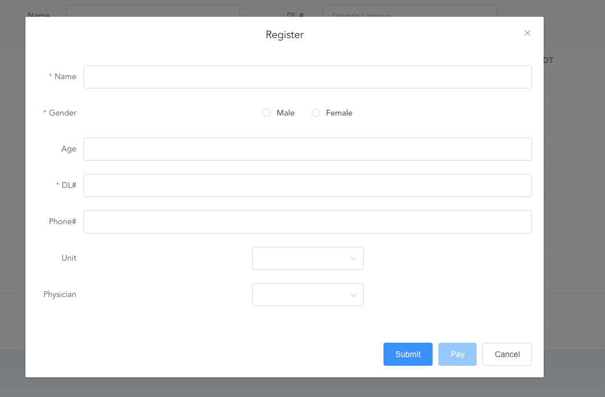
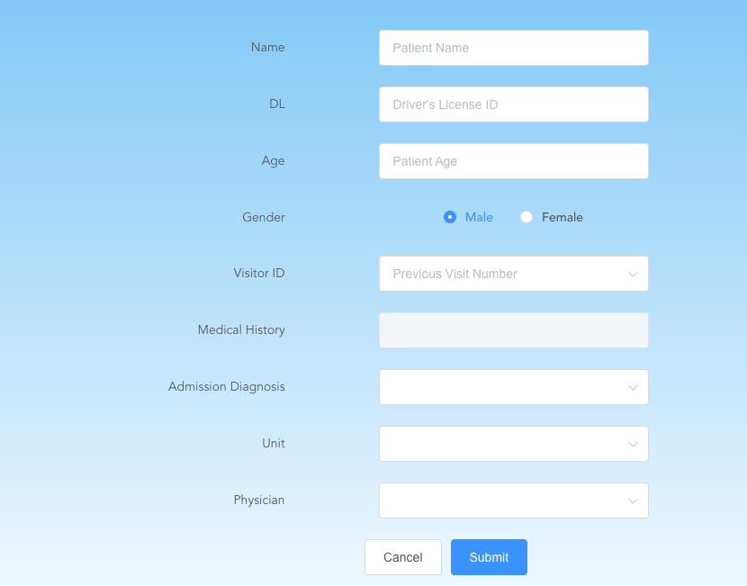
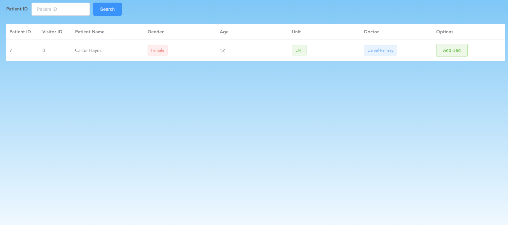
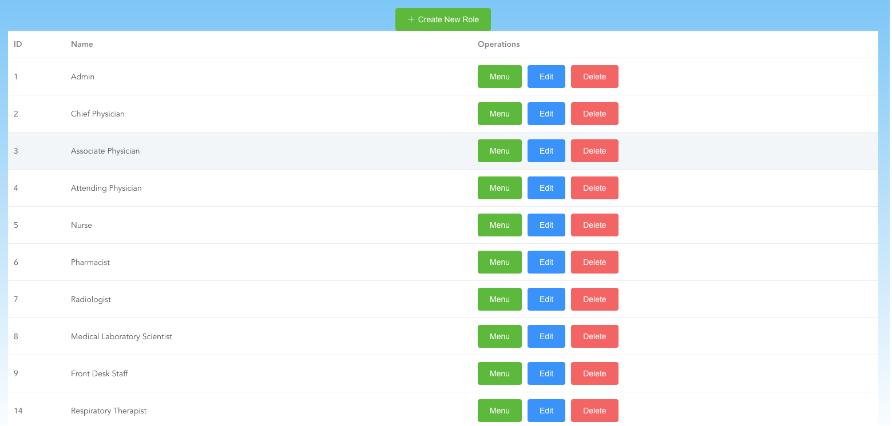
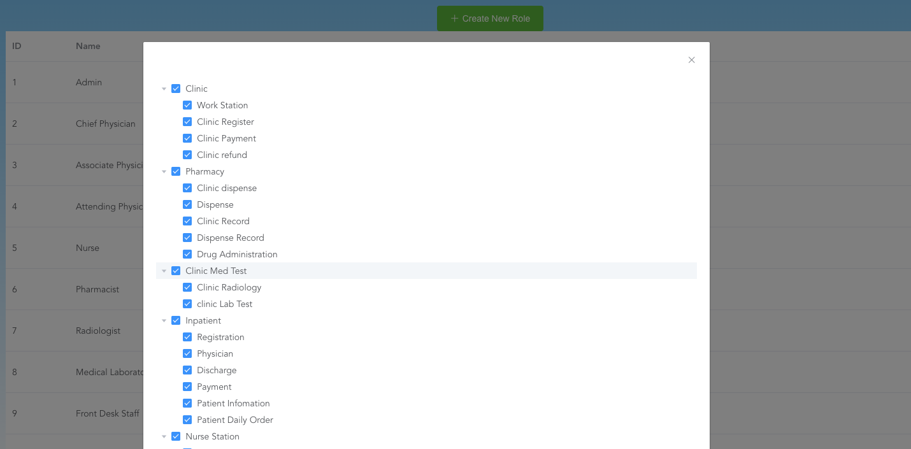

# Hospital Information System

## Preface and Instruction

This back-end development project was developed by my team and I in 2022 for a public hospital in China. The entire software development cycle is xx months. [VUE](https://vuejs.org/), JAVA etc. are used.

After the development of the project was completed, I returned to the United States. I refactored all the previous code and changed it to the English version for everyone's learning and own code archiving.

**Current version: 1.0** (updated in Jan 2024)

>1. Run his-java application
>
>2. Load the his.sql file in his-java into DataGrip or other sql software
>
>3. Use `npm run serve` start his-web
>4. Click link in web storm or Use localhost://8080 to access

## Development Background

China's hospital system has continuously upgraded hospital information management systems over the past 20 years. A more humane and intelligent information management system benefits both medical staff and patients, improving overall efficiency. 

Typically, hospital visits in China are much the same as in Western countries. But there are still differences. For example, most hospitals in China will settle the account immediately instead of mailing bills later. The process of seeing a doctor in a Chinese hospital is roughly as follows.

This customized hospital information management system mainly implements the following key points:

1. Enter the information of each department of the hospital and store it in the SQL database.

2. Each department has different permissions to retrieve patient information.

3. Achieve information reading between various departments, schedule reservations, etc.

4. Realize joint diagnosis and information exchange between special departments.

5. Because the medical treatment process must be rigorous and the operations of most departments are highly interrelated, usually all the prerequisites required for an operation must be met before the operation can be performed correctly.
## Development Background

China's hospital system has continuously upgraded hospital information management systems over the past 20 years. A more humane and intelligent information management system benefits both medical staff and patients, improving overall efficiency. 

Typically, hospital visits in China are much the same as in Western countries. But there are still differences. For example, most hospitals in China will settle the account immediately instead of mailing bills later. The process of seeing a doctor in a Chinese hospital is roughly as follows.

)

This customized hospital information management system mainly implements the following key points:

1. Enter the information of each department of the hospital and store it in the SQL database.

2. Each department has different permissions to retrieve patient information.

3. Achieve information reading between various departments, schedule reservations, etc.

4. Realize joint diagnosis and information exchange between special departments.

5. Because the medical process must be rigorous and the operations of most departments are highly interconnected, all required prerequisites must usually be met in order to function.

# Development Process

All operations start when the patient first enters the hospital to seek a doctor, and then the next step is determined based on the diagnosis of the outpatient doctor.

## Outpatient department

### Register

1. Enter the patient’s basic information as well as the department and doctor you want to visit

2. Pay the registration fee directly at the registration window
3. Generate a patient's registration ID, and then all relevant information about the patient will be searched through this ID

### Medical treatment

1. After paying, go to the designated department and wait for the doctor’s appointment
2. Based on the patient's description, the doctor issues a check list specifying the tests the patient needs to do, and makes a preliminary diagnosis of the patient.
3. After the patient has completed the examination, the doctor makes a final outpatient diagnosis for the patient and feels that the patient may need to be hospitalized to prescribe medication.

### After diagnosis

1. If hospitalization is not required, the patient will go to the outpatient clinic to pay for the examination and medication.
2. If the patient wants to go elsewhere to prescribe medicine or change the doctor, he or she can apply for a refund and re-register at the front desk of the outpatient clinic.

## Inpatient department

1. The patient comes to the inpatient department and registers basic personal information at the front desk of the department. If there is a registration ID, you can directly search through this ID. If you are transferred to another hospital or directly hospitalized, you need to register here.
2. After registration, the front desk nurse is responsible for arranging a specific room and bed for the patient
3. After the doctor's ward rounds, the doctor makes a preliminary diagnosis of the patient's hospitalization and arranges treatment plans, medicines and examinations for the patient. The doctor can place long-term medical orders and short-term medical orders. If it is a medicine that needs to be repeated every day, he can order long-term medical orders. After that, the system will automatically update to the nurse station every day for the nurse to pick up the medicine.When the doctor determines that the patient can be discharged, he needs to make a final diagnosis and record
4. If the doctor prescribes drugs or judges that the patient can be discharged, a nurse is required to review the drugs or discharge decision.

1. After the nurse confirms that the doctor’s prescription is correct, she can go to the pharmacy to get the medicine.
2. Nurses also need to regularly check basic information on patients, such as body temperature and blood pressure.
3. After discharge, the bill for the entire hospitalization period will be automatically generated, and the patient can pay after being discharged.

## Inspection Department

Both outpatient and inpatient patients can come to the examination department to confirm their examination based on their outpatient ID and inpatient ID. After the examination, the results will be uploaded to the database, and the doctor can view the examination results in the patient information.

## Pharmacy

1. After paying, outpatients can go to the pharmacy to pick up medicines using their registration ID.

2. For hospitalized patients, nurses will help patients take medicines
3. Drug management is also a task of the pharmacy. There will be reminders every day whether any drugs are about to expire or are out of stock.

## Administrator

Administrators can make modifications to other hospital information besides medicines, such as employees, positions, wards and employee permissions

### 

### 

